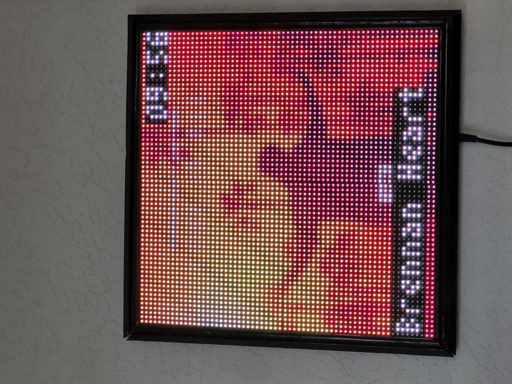

Now Playing from lastfm for the raspberry rgb matrix 64x64.

You can connect spotify to lastfm to show what your now playing

you need to install the https://github.com/hzeller/rpi-rgb-led-matrix library

rename folder to lastfm.
chmod 777 folder of the script.
edit your username and apikey from lastfm.

run:

sudo python3 lastfm.py

